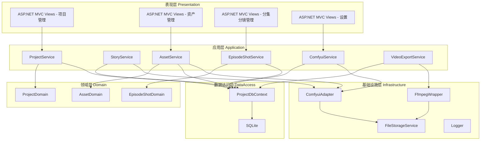
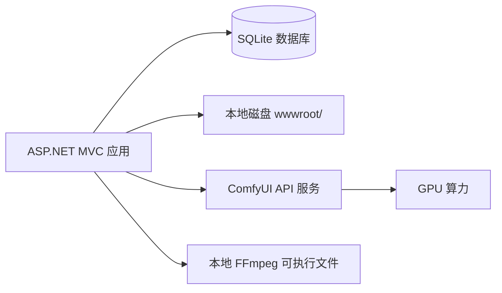

# 漫剧开发工具 - 系统架构设计文档

> **项目名称**：漫剧开发工具
> **文档版本**：v1.0
> **创建日期**：2026-06-29
> **基于需求版本**：docs/req-v20260629/

---

## 1. 项目背景和目标

### 1.1 项目背景

本地有条件运行 ComfyUI 的用户，需要使用自动化工具管理漫剧制作全流程。目的是降低 API 费用成本，同时解决手动管理资产（演员、场景、道具、分镜等）分散混乱的问题。

### 1.2 项目目标

提供一站式漫剧开发工具，从故事创意开始，自动拆分和管理资产，对接 ComfyUI 生成图片/视频素材，最终合并导出完整漫剧视频。

### 1.3 目标用户

使用 ComfyUI 制作漫剧的个人或小团队，本地 PC 端操作，无认证需求。

### 1.4 核心价值

让漫剧制作更简单、更省时间，通过自动化工具提升效率，降低制作成本和门槛。

---

## 2. 技术栈

| 类别      | 技术              | 版本   | 说明                       |
| --------- | ----------------- | ------ | -------------------------- |
| 前端 | ASP.NET MVC Razor Views | .NET 10 | 服务端渲染 MVC 模式 |
| UI 组件 | 自研 CSS（移植 Demo 样式） | - | 自定义前端样式，不依赖第三方组件库 |
| 数据库    | SQLite            | 3.45+  | 轻量级嵌入式数据库         |
| ORM | EF Core           | 8.0    | 实体框架 |
| AI 后端   | ComfyUI           | 最新   | 本地/远程，API 可配        |
| 视频合并  | FFmpeg            | 6.x+   | 依赖本地已安装，启动前验证 |
| 文件存储  | 本地磁盘          | -      | wwwroot/[ProjectId]/asset/ |

---

## 3. 系统架构

### 3.1 分层架构图

### 3.2 功能模块划分

| 模块名称     | 英文标识           | 核心职责                                         | 主要实体                       | 依赖模块                     |
| ------------ | ------------------ | ------------------------------------------------ | ------------------------------ | ---------------------------- |
| 表现层       | PresentationLayer  | Blazor Server 页面、路由、状态管理               | -                              | 所有业务层                   |
| 项目管理     | ProjectService     | 项目 CRUD、ComfyUI 配置管理                      | Project                        | -                            |
| 故事管理     | StoryService       | 故事 CRUD、拆分操作                              | Story                          | ProjectService               |
| 资产管理     | AssetService       | 演员/道具/场景/技能/BGM CRUD、提示词生成         | Actor, Prop, Scene, Skill, Bgm | ProjectService               |
| 分集分镜管理 | EpisodeShotService | 分集/分镜 CRUD、拖拽排序                         | Episode, Shot                  | ProjectService               |
| ComfyUI 服务 | ComfyuiService     | 对接 ComfyUI API、生成图片/视频/音乐、工作流管理 | Workflow, EntityImage          | ProjectService, AssetService |
| 视频导出服务 | VideoExportService | FFmpeg 视频合并导出                              | -                              | EpisodeShotService           |

### 3.3 部署架构

**说明**：

- ASP.NET MVC 单实例部署（本地 PC）
- AJAX / XMLHttpRequest 调用后端 API 进行异步操作
- SQLite 文件存储于本地
- ComfyUI 可以是本地或远程服务
- FFmpeg 依赖本地已安装配置

---

## 4. 与现有系统的集成方案

不涉及现有系统集成。

---

## 5. 数据模型

详见 [ref/01-data-model.md](ref/01-data-model.md)

---

## 6. 核心接口规范

详见 [ref/02-api-spec.md](ref/02-api-spec.md)

---

## 7. 外部系统集成接口

详见 [ref/03-external-integration.md](ref/03-external-integration.md)

---

## 8. 核心算法设计

不涉及复杂业务算法。

---

## 9. 初始化方案

不涉及数据迁移。

---

## 10. 非功能性设计

### 10.1 安全设计

- 无需用户认证
- 纯本地使用，不暴露外部网络
- SQLite 数据库文件本地存储

### 10.2 性能设计

- AI 生成为异步操作，页面显示加载状态（转圈圈）
- 提供获取资源按钮，用户可主动点击查看生成结果
- 使用 AJAX 轮询 / WebSocket 监听 ComfyUI 生成状态
- 前端使用 Bootstrap + jQuery 或 Vanilla JS 实现交互

### 10.3 可观测性

- Serilog 结构化日志记录关键操作
- 生成任务状态持久化到数据库

### 10.4 扩展性

- ComfyUI 适配器接口化设计，支持未来接入其他 AI 后端
- 工作流类型体系设计支持灵活配置
- 预留云端 API 切换架构
