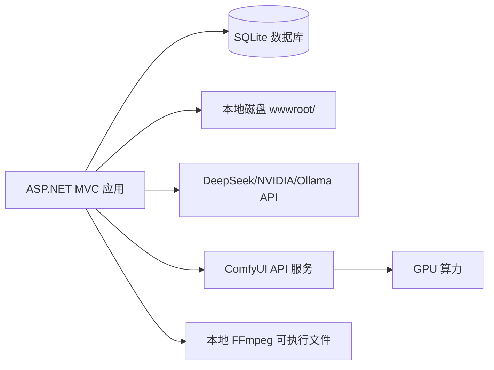

# 漫剧开发工具 - 系统架构设计文档

> **项目名称**：漫剧开发工具
> **文档版本**：v2.0 (2026-07-02)
> **创建日期**：2026-06-29
> **基于需求版本**：docs/req-v20260629/

---

## 1. 项目背景和目标

### 1.1 项目背景

本地有条件运行 ComfyUI 的用户，需要使用自动化工具管理漫剧制作全流程。目的是降低 API 费用成本，同时解决手动管理资产（演员、场景、道具、分镜等）分散混乱的问题。

### 1.2 项目目标

提供一站式漫剧开发工具，从剧本创作开始，自动生成角色/道具/场景/镜头等清单，对接 ComfyUI 生成图片/视频素材，最终合并导出完整漫剧视频。

### 1.3 目标用户

使用 ComfyUI 制作漫剧的个人或小团队，本地 PC 端操作，无认证需求。

### 1.4 核心价值

让漫剧制作更简单、更省时间，通过自动化工具提升效率，降低制作成本和门槛。

---

## 2. 技术栈

| 类别 | 技术 | 版本 | 说明 |
|------|------|------|------|
| 前端 | ASP.NET MVC Razor Views | .NET 10 | 服务端渲染 MVC 模式 |
| UI 组件 | 自研 CSS | - | 自定义前端样式 |
| 数据库 | SQLite | 3.45+ | 轻量级嵌入式数据库 |
| ORM | EF Core | 10.0 | 实体框架 |
| AI 文本 | DeepSeek / NVIDIA / Ollama | - | OpenAI 兼容接口，统一 `IApiGateway` |
| AI 图片/视频 | ComfyUI | 最新 | 本地/远程，API 可配 |
| 视频合并 | FFmpeg | 6.x+ | 依赖本地已安装，启动前验证 |
| 文件存储 | 本地磁盘 | - | wwwroot/[ProjectId]/asset/ |
| 日志 | Serilog | - | Console + File 滚动日志 |

---

## 3. 系统架构

### 3.1 分层架构图

```mermaid
graph TD
    subgraph 表现层 Presentation
        A1[MVC Controllers / API v1]
        A2[Razor Views - 项目管理]
        A3[Razor Views - 剧本/资产/分镜]
        A4[Razor Views - 设置/接口管理]
    end
    subgraph 应用层 Application
        B1[ProjectService / StoryService]
        B2[EpisodeShotService]
        B3[AssetService / TemplateService]
        B4[ApiGateway - 统一AI调用]
        B5[ComfyuiService - 图片/视频/音频]
        B6[VideoExportService]
    end
    subgraph 领域层 Domain
        C1[ProjectDomain]
        C2[AssetDomain]
        C3[EpisodeShotDomain]
        C4[TemplateDomain]
        C5[ApiProviderDomain]
    end
    subgraph 基础设施层 Infrastructure
        D1[ComfyuiClient / WebSocket]
        D2[FfmpegWrapper]
        D3[FileStorageService]
        D4[Database - ProjectDbContext]
        D5[Logger (Serilog)]
    end
    subgraph 外部系统
        E1[DeepSeek API]
        E2[NVIDIA API]
        E3[Ollama 本地]
        E4[ComfyUI 服务]
    end

    A1 --> B1
    A2 --> B1
    A3 --> B2
    A4 --> B4

    B1 --> C1
    B2 --> C3
    B3 --> C2
    B3 --> C4
    B4 --> C5

    B1 --> D4
    B2 --> D4
    B3 --> D4
    B4 --> D4

    D4 --> D5

    B4 --> E1
    B4 --> E2
    B4 --> E3
    B5 --> D1
    D1 --> E4
    B6 --> D2
    D2 --> E4
```

### 3.2 功能模块划分

| 模块名称 | 英文标识 | 核心职责 | 主要实体 | 依赖模块 |
|----------|---------|---------|----------|---------|
| 项目管理 | ProjectService | 项目 CRUD、ComfyUI 配置管理 | Project | - |
| 剧本创作 | StoryService | 剧本(Title+章节列表) CRUD、AI 对话逐章生成 | Story, StoryChapter | ProjectService, ApiGateway |
| 漫剧清单生成 | EpisodeBreakdownService | 从章节自动生成五份清单（角色/道具/场景/BGM/镜头） | StoryChapter → Actor/Prop/Scene/Bgm/Shot | StoryService, ApiGateway |
| 资产管理 | AssetService | Assets CRUD、提示词重新生成、图片/音频生成触发 | Asset, Resource | ProjectService, TemplateService, ComfyuiService |
| 分集分镜管理 | EpisodeShotService | 分集/分镜 CRUD、拖拽排序 | Episode, Shot | ProjectService |
| 提示词模板服务 | TemplateService | 模板 CRUD、内容加载、占位符替换 | PromptTemplate | - |
| API 接口网关 | ApiGateway | 统一文本/AI 调用，支持多提供商切换 | ApiProvider | ProjectService |
| ComfyUI 服务 | ComfyuiService | 对接 ComfyUI API、生成图片/视频/音乐、工作流管理 | Workflow, EntityImage | ProjectService, AssetService, ComfyuiClient |
| 视频导出服务 | VideoExportService | FFmpeg 视频合并导出 | - | EpisodeShotService |
| 接口管理设置 | ApiProviderService | 管理 API 接口配置（LLM/ComfyUI 两种类型） | ApiProvider | - |

### 3.3 部署架构



**说明**：

- ASP.NET MVC 单实例部署（本地 PC）
- AJAX / Fetch API 调用后端 API 进行异步操作
- SQLite 文件存储于本地
- LLM API 为可选云端服务（DeepSeek / NVIDIA / Ollama）
- ComfyUI 可以是本地或远程服务
- FFmpeg 依赖本地已安装配置

---

## 4. 核心架构设计

### 4.1 API 网关模式

所有 AI 文本生成操作通过 `IApiGateway` 统一入口，不直接与特定 LLM 提供商耦合：

```csharp
public interface IApiGateway
{
    // 文本生成（剧本创作、清单生成、提示词生成等）
    Task<string> ChatAsync(long projectId, string prompt, CancellationToken ct = default);
    IAsyncEnumerable<string> ChatStreamAsync(long projectId, string prompt, CancellationToken ct = default);

    // 获取当前步骤使用的 LLM 接口
    ApiProvider GetDefaultLLMProvider(long projectId);

    // 获取 ComfyUI 接口
    ApiProvider GetDefaultComfyUIProvider(long projectId);
}
```

**默认规则**：
- 文字操作（剧本/清单/提示词）默认使用 DeepSeek
- 图片/视频/音频生成固定使用 ComfyUI
- 用户可在设置页切换每个步骤使用的接口

### 4.2 提示词模板管理模式

提示词模板存储在数据库 `PromptTemplates` 表中：

```
TemplateType (类型)         | 用途
----------------------------|---------------------------
CharacterProfile            | 角色四视图提示词模板
PropProfile                 | 道具双视图提示词模板
SceneProfile                | 场景图提示词模板
BgmProfile                  | BGM音频生成提示词模板
StoryGeneration             | AI生成剧本系统提示词
EpisodeBreakdown            | 从章节生成漫剧清单提示词
ShotPlanning                | 从章节生成镜头清单提示词
```

模板内容支持占位符，如 `{{角色名}}`、`{{角色描述}}` 等，由 TemplateService 在调用 AI 前替换：

```csharp
public interface ITemplateService
{
    Task<PromptTemplate> GetByTypeAsync(string templateType);
    Task<PromptTemplate> GetByIdAsync(long id);
    Task<PromptTemplate> CreateAsync(PromptTemplate template);
    Task<PromptTemplate> UpdateAsync(PromptTemplate template);
    Task<string> RenderAsync(PromptTemplate template, Dictionary<string, string> placeholders);
}
```

### 4.3 角色子角色（换装）机制

一个角色（Actor）可通过 `ParentActorId` 关联到主角色，形成子角色树：

```
主角A (Id=1)
  ├── 换装1 (Id=4, ParentActorId=1, Description="校服版")
  ├── 换装2 (Id=5, ParentActorId=1, Description="战斗服版")
```

子角色共享主角色的外貌基础档案，仅记录换装描述差异。

### 4.4 漫画清单生成链路

```
StoryChapter.Content
  └─(ApiGateway → AI分析)
      ├─→ Actor (从章节提取角色信息)
      ├─→ Prop (从章节提取道具信息)
      ├─→ Scene (从章节提取场景信息)
      ├─→ Bgm (从章节提取BGM需求)
      └─→ Episode → Shot (从章节提取镜头信息)
```

所有清单中的对象都标注 `StoryChapterId`（来源章节），可在清单页面查看全部章节产生的所有对象。

### 4.5 完整数据流（从剧本到成品）

```
[Step 1] 创建项目
  → Projects 表

[Step 2] 剧本创作（只生成文本，不生成资源）
  → Story.Title + StoryChapters (ChapterNumber, ChapterName, Content)
  ← 来自 AI 对话或手动输入

[Step 3] 全局资产生成（一次性，从全部章节提取，全局唯一）
  → Assets 表 (AssetType, Name, Description, ParentId)
  ← AI 扫描所有章节文本，提取人物/道具/场景/BGM
  - 用户审核 → 确保同一角色描述全局一致
  - Assets 跨项目通用，不绑定 ProjectId

[Step 4] 资产图片生成（按资产逐个，Assets → LLM提示词 → ComfyUI → Resources）
  → Resources 表 (MediaType, FilePath)
  ← Assets.Description + PromptTemplate.Content → LLM生成提示词 → ComfyUI出图

[Step 5] 分集+分镜生成（按章节，从全局资产中挑选）
  → Episodes 表 (StoryChapterId, AssetRefs JSON)
  → Shots 表 (Description, FirstFrameDescription, AssetRefs JSON)
  ← AI 从章节提取镜头信息，通过 AssetRefs 引用 Assets.Id
  - 用户审核 → 调整分镜顺序、挑选资产、编辑描述

[Step 6] 分镜资源生成（按分镜逐个）
  → Resources 表
  ← Shots.Description → AI生成首帧提示词 → ComfyUI生成首帧图/视频

[Step 7] 视频导出（汇总所有分镜资源）
  ← FFmpeg 合并所有 Shots 的 Resources.Video → 导出成品
```

**一句话总结：先文字（剧本）→ 再资产 → 再资产图片 → 再分集分镜 → 再分镜资源 → 最后导出。**

**数据流向图：**
```
StoryContent ──→ Assets ──→ Resources ──→ Episode ──→ Shots ──→ Resources ──→ FFmpeg
                  ↑            ↑               ↑            ↑              ↑
             资产表全局       资产图片资源    分集列表     分镜列表      首帧+视频资源
            唯一不重复       (Actor图等)    (关联章节)   (按章节生成)  (Shot图等)
```

**关键约束：**
- Asset 全局唯一，不绑定项目（跨项目可复用）
- Resources 通过 FilePath 路径识别归属（`asset_type/id/view_type.ext`）
- Shot 通过 AssetRefs JSON 引用 Assets，软关联
- Episode 通过 StoryChapterId 关联对应章节

**资产复用示例：**
```
Assets 表（全局通用）：
  Id=1, AssetType=Actor, Name="英雄A"
  Id=2, AssetType=Actor, Name="英雄A(校服)", ParentId=1

项目A 的 Shot：AssetRefs = {"actor":[1]}
项目B 的 Shot：AssetRefs = {"actor":[1,2]}
← 同一 Assets.Id=1 可在多个项目中使用
```

### 4.6 章节级 vs 全局级生成策略

```
剧本创作：      按章节逐步生成，逐章存入 StoryChapters
资产生成：      一次性从全部章节提取，全局唯一（避免同角色不同描述）
资源生成：      按资产逐个生成图片/视频
分集分镜：      按章节生成分集和分镜，AssetRefs 软引用 Assets
```

> **为什么资产不按章节生成？** 如果第一章生成"张三部校版"、第二章又生成"张三战斗服"，会导致同一个人有多个不同描述。正确做法是剧本全部完成后，一次性提取所有资产，确保全局唯一。

---

## 5. 与现有系统的集成方案

不涉及现有系统集成。

---

## 6. 数据模型

详见 [ref/01-data-model.md](ref/01-data-model.md)

---

## 7. 核心接口规范

详见 [ref/02-api-spec.md](ref/02-api-spec.md)

---

## 8. 外部系统集成接口

详见 [ref/03-external-integration.md](ref/03-external-integration.md)

---

## 9. 核心算法设计

不涉及复杂业务算法。

---

## 10. 初始化方案

不涉及数据迁移。

---

## 11. 非功能性设计

### 11.1 安全设计

- 无需用户认证
- 纯本地使用，不暴露外部网络
- SQLite 数据库文件本地存储
- API Key 在数据库中加密存储

### 11.2 性能设计

- AI 生成为异步操作，页面显示加载状态（转圈圈）
- 提供获取资源按钮，用户可主动点击查看生成结果
- 使用 AJAX / SSE (Server-Sent Events) 流式获取 AI 回复
- 使用 WebSocket 轮询 / 监听 ComfyUI 生成状态
- 资源生成完成后自动通知用户

### 11.3 可观测性

- Serilog 结构化日志记录关键操作
- 生成任务状态持久化到数据库
- 接口调用日志记录（成功/失败/耗时）

### 11.4 扩展性

- API 网关统一抽象层设计，支持新增 LLM 提供商（只需新增实现类）
- ComfyUI 适配器接口化设计，支持未来接入其他 AI 后端
- 工作流类型体系设计支持灵活配置
- 提示词模板支持运行时编辑，无需重启服务
