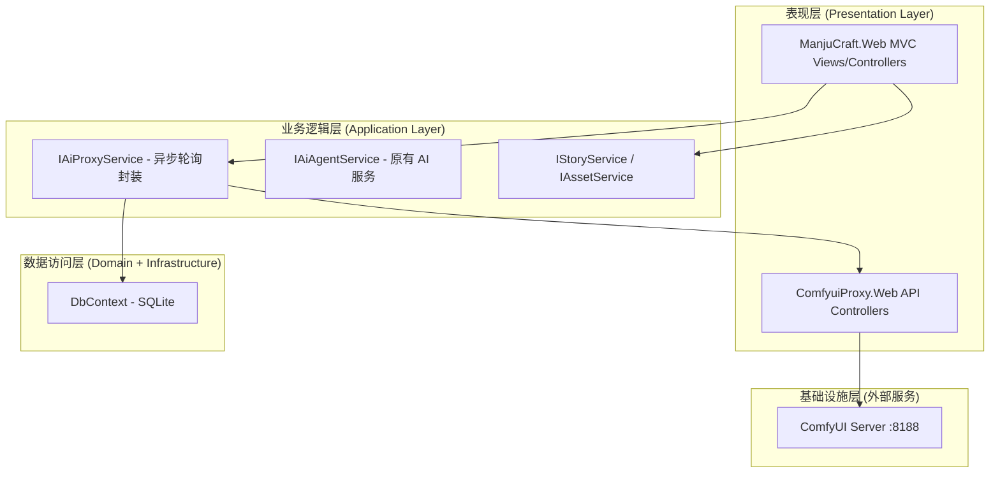
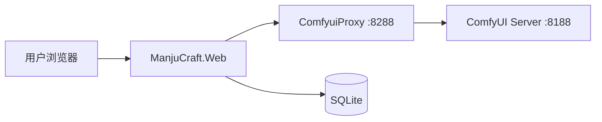

# ManjuCraft.Web AI 创作能力对接 — 系统设计文档

> **项目名称**：ManjuCraft.Web AI 创作能力对接 — manjucraft-ai-integration-v2
> **文档版本**：v1.0
> **创建日期**：2026-07-08
> **基于需求版本**：docs/req-v20260708/

---

## 1. 项目背景和目标

### 1.1 项目背景

ManjuCraft.Web 是漫剧创作平台，提供项目、剧本、资产、制作分镜等核心功能。ComfyuiProxy.Web 代理程序已完成开发，封装了 8 种 AI 工作流（文生图、人物档案、分镜、文本生成、文生视频、图生视频、ACE 音乐、Stable BGM），所有代理接口均已调通。

### 1.2 项目目标

全面打通 ManjuCraft.Web 与 ComfyuiProxy.Web 的 AI 创作能力，使漫剧团队成员能够通过 Web 界面直接使用各类 AI 工具进行内容创作。

### 1.3 核心约束

- ComfyUI 是异步提交+轮询机制（两次 HTTP 交互），而普通大模型 LLM 是同步实时返回（一次交互）
- 需要兼容两种 ProviderType：`ComfyUI` 和 `LLM`
- 所有 ComfyUI 调用统一通过代理，不直接调用 ComfyUI 服务器

---

## 2. 技术栈

| 类别 | 技术选型 | 版本 | 说明 |
|------|----------|------|------|
| 后端框架 | ASP.NET Core MVC | .NET 10.0 | ManjuCraft.Web 主站 |
| 数据库 | SQLite | EF Core 10.0.9 | 本地文件数据库 |
| 前端 | 原生 HTML/CSS/JS | — | 无 SPA 框架 |
| 代理层 | ComfyuiProxy.Web | ASP.NET Core 8.0 | ComfyUI 代理 |
| AI 引擎 | ComfyUI | — | 实际工作流执行 |
| LLM 客户端 | OpenAI 兼容/Ollama/Dashscope/Gemini | — | 通过 AiChatClientFactory 路由 |

---

## 3. 系统架构

### 3.1 分层架构图



#### 各层职责

| 层次 | 职责 |
|------|------|
| 表现层 | MVC Views/Controllers 处理 HTTP 请求；ComfyuiProxy.Web 提供 ComfyUI 代理 API |
| 业务逻辑层 | IAiProxyService 封装 ComfyUI 异步轮询；IAiAgentService 协调 AI 工作流；IAsset/IStory/IEpisode 等业务服务 |
| 数据访问层 | EF Core + SQLite 进行数据持久化 |
| 基础设施层 | ComfyUI 服务器、LLM API 等外部服务 |

### 3.2 功能模块划分

| 模块名称 | 英文标识 | 核心职责 | 新增/修改 | 依赖模块 |
|----------|----------|----------|-----------|----------|
| 故事创作 | StoryModule | AI 生成剧本、AI 改写章节 | 修改 StoryController | IAiProxyService |
| 资产管理（AI 生成） | AssetAIController | AI 角色图、场景图、BGM 生成 | 新增 AiController | IAiProxyService |
| 资产管理（UI） | AssetsModule | 资产 CRUD、文件上传 | 修改 Views/Assets/Index.cshtml | AssetsController |
| 分镜工作台 | ProductionModule | AI 分镜脚本、分镜图、首帧图、视频 | 修改 Production/Index.cshtml | IAiProxyService |

### 3.3 部署架构

| 服务名称 | 运行方式 | 端口 | 说明 |
|----------|----------|------|------|
| ManjuCraft.Web | ASP.NET Core 独立运行 | 可配置 | 漫剧平台主站 |
| ComfyuiProxy.Web | ASP.NET Core 独立运行 | 8288 | ComfyUI 代理 |
| ComfyUI Server | ComfyUI 原生服务 | 8188 | 实际 AI 工作流执行 |
| SQLite | 本地文件 | — | 数据库 |



---

## 4. 与现有系统的集成方案

### 4.1 集成方式

ManjuCraft.Web 通过 HttpClient 调用 ComfyuiProxy.Web 的 API，形成两层调用链：

```
ManjuCraft.Web 发起请求
    ↓
POST/GET http://{ComfyuiProxyUrl}/{agent-endpoint}
    ↓
ComfyuiProxy.Web 执行工作流 → ComfyUI Server
    ↓
返回结果给 ManjuCraft.Web
```

### 4.2 调用链详情

**核心流程：提交 → 轮询 → 返回**

```
前端触发 AI 生成
    ↓
POST /api/v1/ai/{module}/{action}  (AiController)
    ↓
IAiProxyService.SubmitAndPollAsync(prompt, workflowType, timeout=10min, interval=5s)
    ├─ ComfyUI 路径
    │   → POST {proxyUrl}/api/comfyui/{workflow}/submit
    │   → 拿到 promptId
    │   → 每 5 秒 GET {proxyUrl}/api/comfyui/result/{promptId}
    │   → 10 分钟内等到结果 → 返回 resultUrl
    │   → 10 分钟超时 → 返回 { success: false, promptId }
    │
    └─ LLM 路径
        → 直接 HTTP POST 到大模型 API
        → 同步返回 text 结果
    ↓
返回给前端
    ├─ 成功 → 自动替换资产 / 保存章节
    └─ 超时 → 显示 promptId，按钮变为 "获取资产" + "重新生成"
```

### 4.3 配置约定

| 配置项 | 位置 | 默认值 | 说明 |
|--------|------|--------|------|
| ComfyuiProxyUrl | ManjuCraft.Web/appsettings.json | `http://localhost:8288` | ComfyUI 代理地址 |
| ComfyUI:Url | ComfyuiProxy.Web/appsettings.json | `http://localhost:8188` | ComfyUI 服务器地址 |

---

## 5. 数据模型

本次不修改数据模型，不涉及数据层变更。已有的实体（Project, Story, StoryChapter, Asset, Resource 等）保持不变。

---

## 6. 核心接口规范

详见 [ref/02-api-spec.md](ref/02-api-spec.md)

---

## 7. 外部系统集成接口

详见 [ref/03-external-integration.md](ref/03-external-integration.md)

---

## 8. 核心算法设计

不涉及复杂业务算法，省略。

---

## 9. 初始化方案

无数据迁移，省略。

---

## 10. 非功能性设计

### 10.1 安全设计

- 无用户认证和权限管理系统
- API Key 存储于 SQLite 数据库（明文）

### 10.2 性能设计

| 维度 | 设计 |
|------|------|
| 轮询间隔 | 5 秒一次 |
| 超时时间 | 10 分钟（ComfyUI 任务等待） |
| ComfyUI 并发 | 不可并发，单线程执行 |
| 超时处理 | 返回 promptId，前端点击"获取资产"继续查询 |

### 10.3 可观测性

- 使用 Serilog 结构化日志记录代理调用

### 10.4 扩展性

- IAiProxyService 采用接口隔离，新增工作流只需在 ComfyuiProxy.Web 添加新的 Agent
- 前端通过统一的 `/api/v1/ai/*` 路由，新增功能只需增加新路径
